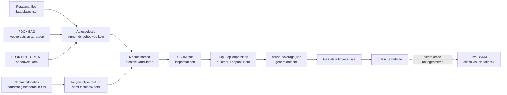

# Loopafstanden naar restafvalcontainers in de gemeente Schagen

[Bekijk de website](https://afvalcontainers-warmenhuizen.nl/)

Deze statische webapp laat per adres binnen de bebouwde kom zien wat de berekende loopafstand is naar restafvalcontainers. De kaart vergelijkt de route via straten en paden met de door de gemeente Schagen genoemde richtafstand van ongeveer 275 meter.

De website publiceert momenteel analyses voor **Warmenhuizen, Tuitjenhorn en Waarland**. In `data/places.json` staan daarnaast alvast Dirkshorn, Sint Maarten, Burgerbrug, Oudesluis en Schagerbrug. Een geconfigureerd dorp verschijnt pas op de publieke website zodra alle benodigde runtime-data aanwezig is.

Actuele aantallen en verdelingen staan op de pagina [Analyses](https://afvalcontainers-warmenhuizen.nl/analyses/). Ze worden tijdens de build uit de gegenereerde datasets gelezen en daarom niet handmatig in deze README bijgehouden.

## Datastroom



Belangrijke nuances:

- BAG levert verblijfsobjectadressen; de generator controleert niet afzonderlijk op woonfunctie.
- Per adres worden eerst de zes hemelsbreed dichtste toegankelijke rest-/semi-restcontainers gekozen. Alleen deze kandidaten worden op OSRM-loopafstand gerangschikt.
- De beste drie routes worden opgeslagen. De beste daarvan bepaalt de afstandscategorie van het adres.
- Ontbrekende routegeometrie kan in de browser live via OSRM worden opgehaald. Dit wijzigt de vooraf berekende afstand, rangschikking en kleurcategorie niet.
- Een adres waarvoor geen looproute wordt gevonden krijgt de grijze status `unreachable`; hemelsbrede afstand vervangt de loopafstand niet.

Zie [Databronnen en berekening](docs/data-pipeline.md) voor de volledige methode, uitvoerbestanden en beperkingen.

## Afstandscategorieën

| Berekende loopafstand | Interne status | Kleur |
|---|---|---|
| 0–100 m | `within_100` | Groen |
| >100–125 m | `between_100_125` | Geel |
| >125–150 m | `between_125_150` | Oranje |
| >150–275 m | `between_150_275` | Rood |
| >275 m | `over_275` | Donkerrood |
| Geen route | `unreachable` | Grijs |

De grenzen zijn kaartcategorieën voor vergelijking en communicatie. Alleen 275 meter komt rechtstreeks uit de gemeentelijke richtafstand; de overige grenzen zijn mede geïnformeerd door evaluaties uit andere gemeenten. Zie [Onderzoeksbasis](docs/research-basis.md).

## Lokaal ontwikkelen

Vereisten: Node.js 24 of hoger en npm.

```sh
npm ci
npm run check
npm run serve
```

Open daarna <http://127.0.0.1:8000/>. `npm run check` voert syntax- en unittests uit, maakt de gesplitste runtime-data opnieuw aan, valideert de data en bouwt `dist/`.

Meer commando's, Playwright-instructies en de repositorystructuur staan in [Ontwikkelen en testen](docs/development.md).

## Documentatie

- [Documentatie-index](docs/README.md)
- [Databronnen en berekening](docs/data-pipeline.md)
- [Onderzoeksbasis](docs/research-basis.md)
- [Ontwikkelen en testen](docs/development.md)
- [Dorpskern toevoegen](docs/adding-a-place.md)
- [Genereren en deployen](docs/deployment.md)
- [Data- en bronlicenties](DATA-LICENSE.md)

## Repositorystructuur

- `src/`: HTML-template, modulaire CSS en browsercode voor Leaflet.
- `src/shared/`: gedeelde domeinlogica voor browsercode en Node-scripts.
- `data/places.json`: catalogus met alle geconfigureerde dorpen.
- `data/places/<plaats-id>/`: handmatige containerdata en gegenereerde analysedata per dorp.
- `scripts/`: generator-, validatie-, build- en hulpscripts.
- `tests/`: Node-unittests en Playwright-browsertests.
- `docs/`: onderhouds- en onderzoeksdocumentatie.
- `.github/workflows/`: controles, datageneratie en GitHub Pages-deployment.

`dist/` is gegenereerde buildoutput en wordt niet gecommit.

## Licenties en attributie

De broncode valt onder de [MIT-licentie](LICENSE). De eigen datasamenstelling en analyses worden, voor zover daarop rechten van de projectauteur rusten, beschikbaar gesteld onder [CC BY 4.0](https://creativecommons.org/licenses/by/4.0/). Afgeleide brongegevens behouden hun eigen voorwaarden, waaronder OpenStreetMap onder ODbL.

Zie [DATA-LICENSE.md](DATA-LICENSE.md) voor de precieze afbakening en vereiste bronvermeldingen.
