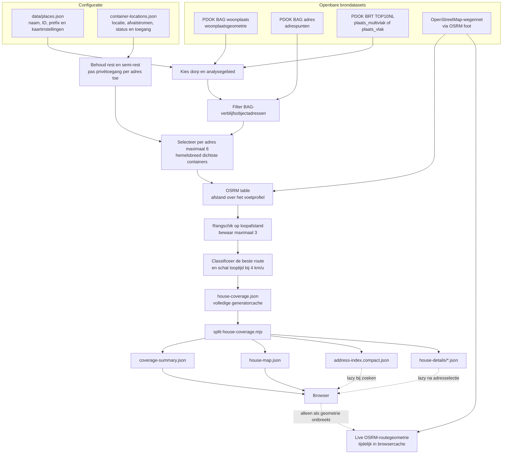

# Databronnen en berekening

Dit document beschrijft hoe de vooraf berekende loopafstanden tot stand komen en welke gegevens de browser uiteindelijk gebruikt. De implementatie staat hoofdzakelijk in `scripts/generator/house-coverage.mjs`, `scripts/split-house-coverage.mjs` en `scripts/build/site.mjs`.

## Overzicht

## 1. Plaats- en containerconfiguratie

`data/places.json` bevat alle geconfigureerde dorpen. De standaardpaden worden afgeleid van `data/places/<plaats-id>/`.

`container-locations.json` is de handmatig beheerde bron voor containerlocaties. Een container kan meerdere afvalstromen bevatten, bijvoorbeeld GFE en restafval. Voor de loopafstandsanalyse tellen alleen de typen `rest` en `semi-rest` mee; een GFE-only container blijft wel zichtbaar op de kaart maar telt niet mee voor de rangschikking.

Zowel nieuwe als bestaande restafvalcontainers kunnen meetellen. Een container met `access.scope: "private"` is alleen kandidaat voor adressen die door `access.allowedAddresses` worden toegestaan.

De gemeente-URL in het plaatsmanifest is een bronverwijzing voor het plan. De containercoördinaten worden niet automatisch van die pagina opgehaald.

## 2. Analysegebied en adressen

De generator haalt voor het gekozen dorp op:

1. de aangewezen woonplaatsgeometrie uit de BAG-collectie `woonplaats`;
2. het vlak voor de bebouwde kom uit BRT TOP10NL, eerst uit `plaats_multivlak` en anders uit `plaats_vlak`;
3. BAG-adrespunten binnen de bounding box van de woonplaats.

Een adrespunt wordt alleen opgenomen wanneer het:

- status `Naamgeving uitgegeven` heeft;
- bij een `Verblijfsobject` hoort;
- dezelfde woonplaatsnaam heeft als het gekozen dorp;
- binnen de BAG-woonplaatsgeometrie ligt;
- binnen het geselecteerde BRT-bebouwde-komvlak ligt.

De generator filtert niet op het BAG-gebruiksdoel `woonfunctie`. De term “adres” of “BAG-verblijfsobjectadres” is daarom nauwkeuriger dan “huishouden” of “woning”.

## 3. Kandidaten en loopafstanden

Voor ieder adres berekent de generator eerst met de haversine-formule de hemelsbrede afstand naar iedere toegankelijke rest-/semi-restcontainer. Standaard worden de zes dichtste kandidaten behouden (`--candidate-count=6`).

Deze voorselectie beperkt het aantal aanvragen aan de publieke OSRM-dienst. Het betekent ook dat de analyse niet alle containers via het wegennet vergelijkt. In een uitzonderlijke wegenstructuur kan een container buiten de zes hemelsbreed dichtste kandidaten een kortere looproute hebben.

De kandidaten worden in batches naar de OSRM Table-service met profiel `foot` gestuurd. De gevonden loopafstanden worden oplopend gerangschikt en standaard worden de beste drie opgeslagen (`--result-count=3`). De eerste route bepaalt de afstand en kleurcategorie van het adres.

De weergegeven looptijd komt niet rechtstreeks uit OSRM. Deze wordt reproduceerbaar geschat uit de routeafstand met een wandelsnelheid van 4 km/u.

## 4. Afstandscategorieën

De centrale indeling staat in `src/shared/coverage.js`:

| Voorwaarde | Status | Kleur |
|---|---|---|
| afstand ≤ 100 m | `within_100` | groen |
| 100 m < afstand ≤ 125 m | `between_100_125` | geel |
| 125 m < afstand ≤ 150 m | `between_125_150` | oranje |
| 150 m < afstand ≤ 275 m | `between_150_275` | rood |
| afstand > 275 m | `over_275` | donkerrood |
| geen berekende route | `unreachable` | grijs |

De classificatie gebruikt altijd de vooraf berekende loopafstand. Hemelsbrede afstand wordt ter vergelijking getoond, maar niet gebruikt als vervangende dekking wanneer OSRM geen route vindt.

## 5. Routegeometrie

OSRM-afstanden en routegeometrieën zijn twee afzonderlijke onderdelen:

- De Table-service levert de afstanden waarmee de rangschikking en categorie worden bepaald.
- `--include-route-geometries` haalt aanvullend vereenvoudigde lijngeometrie op voor de opgeslagen top drie.
- Zonder deze optie blijven de geometrieën leeg, maar de berekende afstanden blijven volledig bruikbaar.
- Bij een geselecteerd adres kan de browser ontbrekende of ongeldige geometrie live via OSRM ophalen.

Een live fallback is alleen voor de getekende routelijn. De uitkomst wordt niet naar de repository geschreven en overschrijft geen batchafstand, rangschikking, samenvatting of kleurcategorie. De browser labelt zo'n lijn als live fallback.

## 6. Gegenereerde bestanden

Per gepubliceerd dorp bestaan de volgende bestanden:

| Bestand | Functie | In `dist/` |
|---|---|---|
| `container-locations.json` | Handmatig beheerde containerbron | Ja |
| `house-coverage.json` | Volledige generatorcache en bron voor de split | Nee |
| `coverage-summary.json` | Metadata en totalen voor de actieve plaats | Ja |
| `house-map.json` | Compacte markerlaag met ID, coördinaat en categorie | Ja |
| `address-index.compact.json` | Zoekindex voor adressen | Ja, lazy geladen |
| `house-details/*.json` | Volledige adres- en routegegevens, per straat gebundeld | Ja, lazy geladen |

Een detailbundel bevat maximaal 75 adressen. De build maakt daarnaast twee manifests:

- `dist/data/places.json`: alleen publiceerbare dorpen;
- `dist/data/places-catalog.json`: alle geconfigureerde dorpen voor de containereditor.

## 7. Publiceerbaarheid

Een dorp is publiceerbaar wanneer de volgende onderdelen bestaan:

- `container-locations.json`;
- `coverage-summary.json`;
- `house-map.json`;
- `address-index.compact.json`;
- minimaal één JSON-bestand in `house-details/`.

De build en validatie bepalen dit uit de bestanden, niet uit een aparte publicatievlag.

## 8. Actualiteit en beperkingen

- De uitkomst is een momentopname van containerlocaties, BAG, BRT en het OSM-wegennet ten tijde van generatie.
- Een route is een modeluitkomst. Tijdelijke afsluitingen, informele paden, oversteekbaarheid, verlichting, hellingen en sociale veiligheid zijn niet volledig vertegenwoordigd.
- De analyse bewijst niet welke container een afvalpas daadwerkelijk opent; zij gebruikt de container- en toegangsregels in de repository.
- De top-zesvoorselectie is een performancekeuze en geen volledige netwerkoptimalisatie over alle containers.
- Adrestotalen zijn BAG-verblijfsobjectadressen binnen het gekozen BRT-vlak, niet automatisch aantallen inwoners of huishoudens.
- De afstandscategorieën ondersteunen vergelijking en communicatie; zie [Onderzoeksbasis](research-basis.md) voor hun interpretatie.

## Bronnen

- [PDOK BAG OGC API](https://api.pdok.nl/kadaster/bag/ogc/v2?f=html&lang=nl)
- [PDOK BRT TOP10NL](https://api.pdok.nl/brt/top10nl/ogc/v1/api?f=html)
- [OpenStreetMap](https://www.openstreetmap.org/)
- [OSRM](https://project-osrm.org/)
